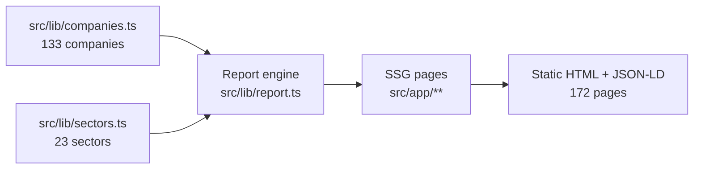

# ARCHITECTURE.md

> **Status:** Current, mirrors the code as of 2026-08-06 (v0.3.0).
> This is the most important document in the repository. Update it the moment
> architecture changes.

## 1. Overview

**Passive** is a fully static, server-rendered equity research website. There
is no backend, no database, no API server, and no authentication. All content
is derived at build time from TypeScript data modules; the site is deployed as
pre-rendered HTML.



### Architecture layers

| Layer | Implementation |
|---|---|
| Frontend | React 19 server components; App Router; 5 client components |
| Backend | None (static generation at build time) |
| APIs | None (public surface = pages, `sitemap.xml`, `robots.txt`) |
| Database | None — static TS modules act as the data layer (`docs/DATABASE.md`) |
| Authentication / Authorization | Not applicable (public read-only site) |
| Storage | No runtime storage; theme preference in `localStorage` |
| Deployment | Next.js on any Node host; Vercel recommended (`docs/DEPLOYMENT.md`) |

## 2. Design Philosophy

1. **Decision-first content.** Reports are written to the institutional
   standard: rating/target on the first screen, evidence labelled
   (F/M/C/E/I/S/U), forecasts driver-based, valuation tested with reverse DCF,
   and risks expressed as monitorable registers. This is content design, not
   UI gimmickry.
2. **Single source of truth.** The 25-section framework lives once in
   `reportToc` (`src/lib/report.ts`). Methodology, table of contents, and the
   on-page sidebar all derive from it. Data fields are never re-derived with
   divergent constants.
3. **Static by default.** Every page is SSG; anything that must be interactive
   is a deliberately small client island (search, filters, theme, scrollspy).
4. **No new dependencies.** Runtime deps are `next`, `react`, `react-dom` —
   nothing else. Features are built with CSS + React only.
5. **Docs are code.** Every meaningful change updates `docs/` (see
   `OPENCODE.md` § Documentation Rules).

## 3. Folder Structure

```
src/
  app/                    # Routes (App Router, server components by default)
    layout.tsx            # Root layout: DM Sans, Nav, Footer, global metadata
    globals.css           # Entire design system — the only stylesheet
    page.tsx              # Home (hero, search, sector grid, recent reports)
    research/             # Research browser (client filter/sort)
    sectors/              # Sector index
    sectors/[slug]/       # Sector detail page (SSG via generateStaticParams)
    company/[slug]/       # Company report page (SSG; dynamicParams=false)
    latest-research/      # Recently updated reports
    coverage-universe/    # All companies, alphabetical
    about/ contact/ legal/ privacy/ terms/ methodology/
    not-found.tsx         # 404
    sitemap.ts            # sitemap.xml
    robots.ts             # robots.txt
  components/             # 12 reusable components (5 client, 7 server)
  lib/                    # Pure TypeScript logic + data (no React)
    companies.ts          # Company interface, 133 rows, helpers
    sectors.ts            # Sector interface, 23 rows, helpers
    report.ts             # reportToc + report math helpers
```

## 4. Data Flow

### Build-time (generation)

```mermaid
flowchart TB
  ROWS[companies.ts ROWS tuples] --> MAP[companies.map() -> Company[]]
  SECTORS[sectors.ts] --> LIBS[lib helpers]
  MAP --> SSG[generateStaticParams<br/>133 slugs]
  MAP --> REPORT[report.ts<br/>financialHistory/forecasts/scenarios/pricedIn]
  SSG --> PAGE[company/[slug]/page.tsx]
  REPORT --> PAGE
  LIBS --> PAGE
  PAGE --> HTML[Static HTML + ResearchArticle JSON-LD]
  HTML --> SITEMAP[sitemap.ts]
```

### Runtime

- The browser fetches static HTML + RSC payload. All data is already embedded.
- Client components hydrate for interactivity only:
  - `Nav` (mobile menu, scroll state)
  - `ThemeToggle` (dark mode)
  - `SearchCompanies` (live dropdown over the 133-company index)
  - `ResearchBrowser` (filter/sort of report list; reads `useSearchParams`)
  - `ReportToc` (IntersectionObserver scrollspy over `[data-report-section]`)

### Theme flow

`localStorage["passive-theme"]` holds `"dark" | "light"`. `ThemeToggle` flips
the `dark` class on `<html>`. The initial class is set by a small inline
script so there is no flash; the toggle intentionally drives the DOM directly
(class-driven) rather than via React state to satisfy the
`react-hooks/set-state-in-effect` lint rule (see `docs/DECISIONS.md` ADR-005).

## 5. State Management

- **Server**: none — pages are pure functions of `(slug) => data`.
- **Client**: local component state only (`useState`/`useEffect`). No global
  store, no context providers, no external state libraries.
- **URL as state**: `ResearchBrowser` reads the `sector` and `q` search
  params; deep links work.
- **Persistence**: theme preference only, in `localStorage`.

## 6. Rendering Strategy

| Route type | Strategy | Notes |
|---|---|---|
| `/company/[slug]` | **SSG** (`generateStaticParams`, `dynamicParams=false`) | 133 pages pre-rendered; unknown slug → 404 |
| `/sectors/[slug]` | **SSG** (`generateStaticParams`) | 23 pages |
| All other pages | **Static** | Prerendered at build |
| `sitemap.xml` / `robots.txt` | Generated routes | Built from `metadataBase` (`https://passive-research.in`) |

Full static export (`output: "export"`) is **not** enabled — hosting is a
Node-capable Next.js host (Vercel). A pure static export remains a future
option (`docs/ROADMAP.md`).

## 7. API Architecture

There is no backend API. The externally visible surface is:

- **HTML pages** — see `docs/API.md` for the full route table.
- **`/sitemap.xml`** — all 172+ URLs with lastmod from data.
- **`/robots.txt`** — allow all, sitemap pointer.
- **JSON-LD** — `ResearchArticle` schema on every `/company/[slug]` page,
  injected via `dangerouslySetInnerHTML` with data built from the internal
  dataset only (no user input — safe by construction; `docs/SECURITY.md`).

## 8. Component Architecture

- **Server components (default)** render content: `CompanyCard`, `SectorCard`,
  `CompanyLogo`, `RatingBadge`, `SectorIcon`, `ReportContent`, `Footer`.
- **Client components** ("use client"): `Nav`, `ThemeToggle`,
  `SearchCompanies`, `ResearchBrowser`, `ReportToc`.
- Components are **presentational + data-accepting**: they receive `Company`
  / `Sector` objects (never fetch), and link through `next/link`.
- Full props/usage catalog: `docs/COMPONENTS.md`.

## 9. Service Architecture

"Services" are pure functions in `src/lib/`:

- `companies.ts` — dataset + lookups (`getCompany`, `getCompaniesBySector`,
  `getPeers`, `sortByRating`, `sectorCompanyCount`, `latestSectorUpdate`) and
  formatters (`formatCr`, `formatIndian`, `formatPrice`, `formatUpdated`).
- `sectors.ts` — dataset + lookups (`getSector`, `sectorName`).
- `report.ts` — report framework (`reportToc` = 25 sections) and math:
  `financialHistory`, `forecasts`, `growthCagr`, `upsides`, `ratingLanguage`,
  `readingTime`, `impliedPeOnTarget`, `scenarioCases`, `weightedTarget`,
  `pricedInAnalysis`, `totalReturnPct`, `impliedEps`, `round1`.

Contract notes:
- All money amounts are **₹ crore**; prices are **₹ per share**.
- All helpers are pure and total (return `undefined`/`null`/`"—"` rather than
  throwing) so SSG never fails on a data edge case.

## 10. Report Framework (content architecture)

Every company page renders 25 fixed sections (`reportToc`), which the
Methodology page and `ReportToc` sidebar share. Sections 01–25:

01 Executive Summary · 02 Investment Thesis · 03 Business Overview ·
04 Business Model · 05 Revenue Breakdown · 06 Geographic Mix ·
07 Segment Analysis · 08 Competitive Positioning · 09 Industry Overview ·
10 Market Size · 11 Growth Drivers · 12 Management Quality ·
13 Corporate Governance · 14 Financial Analysis · 15 Balance Sheet ·
16 Capital Allocation · 17 Historical Performance · 18 Forecasts ·
19 Valuation · 20 Target Price · 21 Risks · 22 Catalysts · 23 ESG ·
24 Conclusion · 25 Appendix

Institutional conventions implemented in `ReportContent` (per the *Institutional
Equity Research Manual*, `docs/DECISIONS.md` ADR-006):

- Evidence labels `[F] [M] [E] [I]` inline and `(E)` on estimate columns.
- Thesis map, moat scorecard, risk register, catalyst register (tables).
- Reverse-DCF "what is priced in" table, sensitivity grid, 25/50/25
  bull/base/bear scenario cards, probability-weighted target check.
- Source policy: screener.in primary (annual reports, credit ratings, concall
  transcripts/PPT), in.marketscreener.com for consensus.

## 11. Error Handling

- Unknown company/sector slug → `notFound()` → custom 404 (`not-found.tsx`).
- Data edge cases (e.g., missing P/E) → `null` / `"—"` rendering, never NaN:
  `pricedInAnalysis` returns `null` when P/E is missing; guards exist around
  division by zero (`Math.max(1, …)`) in share/scale math.
- No network or server errors are possible at runtime (fully static).

## 12. Logging

None in production (static site). Build output is the diagnostic surface:
`next build` reports compilation, type-check, and per-page generation.
Development logs come from `next dev`.

## 13. Performance Strategy

- 100% static HTML; zero client data fetching. Logos are committed local
  assets in `public/logos/` (`next/image` unoptimized, initials-square
  fallback) — no runtime image requests to third parties.
- One stylesheet, no third-party CSS; DM Sans is self-hosted by
  `next/font` (no Google Fonts request at runtime).
- Client JS is limited to the 6 interactive components; everything else is RSC
  output.
- `scroll-padding-top` + smooth scroll for anchor navigation.
- Build-time goal: no network in the browser beyond the HTML/RSC payload.

## 14. Security Strategy

- Attack surface is near zero (static, read-only, no forms that persist, no
  auth). Full threat model in `docs/SECURITY.md`.
- `dangerouslySetInnerHTML` used in exactly one place — the JSON-LD script —
  with data sourced exclusively from the internal dataset.
- Content-Security-Policy, headers, and dependency policy are documented in
  `docs/SECURITY.md` (Vercel defaults currently; strict CSP is a roadmap item).

## 15. Scalability Considerations

- Adding companies = adding rows in `companies.ts`; build time grows linearly
  (~172 pages today, SSG in under 20s on a laptop).
- The pure-function data layer could be swapped for a real data source
  (API/DB) without touching page components — that is the intended upgrade
  path (`docs/ROADMAP.md`, `docs/DATABASE.md`).
- At thousands of companies, options: keep SSG (build time), switch to
  `output: "export"` + CDN, or move to ISR/on-demand rendering.

## 16. Future Architecture Plans

See `docs/ROADMAP.md`. Short version:

- Real-data enrichment pipeline (screener.in exports → typed JSON → same lib
  contract) — **no page changes required**.
- Charts (SVG) for history/bridges per the manual's chart standards.
- Strict CSP + security headers; `npm audit` gate in CI.
- Optional: public JSON API for the coverage universe; static export + CDN.

---

## Change Log for this file

| Date | Change |
|---|---|
| 2026-08-06 | Created; documents the static data-driven architecture (v0.3.0) |