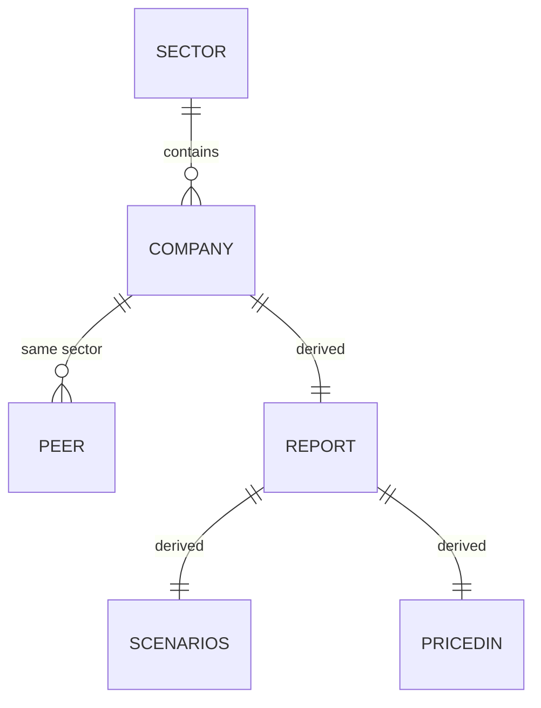

# DATABASE.md — The Static Data Layer

> **There is no database.** The "database" is the TypeScript data layer in
> `src/lib/` (see `docs/DECISIONS.md` ADR-002). It is type-checked at build
> time, has no migrations, and is the single source of truth for all content.
> This document defines its schema, relationships, constraints, and the
> future upgrade path.

## 1. Entities

### Company (`src/lib/companies.ts`)

`Company` is the core entity; 133 instances are built from `ROWS` tuples.

| Field | Type | Notes |
|---|---|---|
| `slug` | `string` | Unique URL id, kebab-case (e.g., `hdfc-bank`) |
| `name` | `string` | Display name |
| `legalName` | `string` | Full legal entity name |
| `ticker` | `string` | NSE ticker |
| `sector` | `string` | FK → `Sector.slug` |
| `industry` | `string` | Industry label shown on cards |
| `logoColor` | `string` | Hex used by `CompanyLogo` gradient |
| `recommendation` | `"Strong Buy"\|"Buy"\|"Accumulate"\|"Hold"\|"Reduce"\|"Sell"` | Rating enum |
| `currentPrice` | `number` | ₹ per share |
| `targetPrice` | `number` | ₹ per share, 12-month |
| `upsidePct` | `number` | (target − current) / current × 100 |
| `marketCapCr` | `number` | ₹ crore |
| `revenueCr` | `number` | TTM revenue, ₹ crore |
| `netProfitCr` | `number` | TTM net profit, ₹ crore |
| `revenueGrowthPct` | `number` | Latest reported YoY growth % |
| `ebitdaMarginPct` | `number` | % |
| `roePct` | `number` | % |
| `rocePct` | `number` | % |
| `fcfCr` | `number` | TTM free cash flow, ₹ crore |
| `pe` | `number \| null` | `null` → render "—" |
| `dividendYieldPct` | `number` | % |
| `debtEquity` | `number` | x |
| `shortThesis` | `string` | One-sentence investment summary |
| `updatedDate` | `string` | ISO date `YYYY-MM-DD` |

### Sector (`src/lib/sectors.ts`)

| Field | Type | Notes |
|---|---|---|
| `slug` | `string` | Unique, kebab-case (e.g., `information-technology`) |
| `name` | `string` | Display name |
| `description` | `string` | Shown on sector pages |
| `icon` | `string` | Key into `SectorIcon` icon map |

### Derived entities (computed, no storage)

- **Peer set** — `getPeers(company, count)` = same-sector companies sorted by
  `marketCapCr` desc, excluding self.
- **Report** — 25 sections derived by `report.ts` from a `Company`.
- **Scenario cases** (Bull/Base/Bear) — derived by `scenarioCases()`.

## 2. Relationships



- `Company.sector` → `Sector.slug` (**FK, one-to-many**): every company
  belongs to exactly one sector; sectors may have zero companies.
- **Peer set** is a derived relationship (same-sector companies), not stored.
- No company-to-company references are stored (peer cards are computed).

## 3. Constraints & Invariants

Enforced by **TypeScript at build time** (no runtime enforcement needed):

- `slug` unique per company and per sector (checked by lookup functions
  returning first match).
- `recommendation` ∈ the 6-value `Rating` union — any value outside fails
  `npm run build`.
- `pe` nullable — code must render `"—"` (never compute with `null`).
- Every `Company.sector` must match a `Sector.slug`; unknown sectors would
  surface as missing `getSector()` (guarded with fallbacks).
- Financial conventions: money in **₹ crore** (fields ending `Cr`); price in
  **₹ per share**; ratios in %; `debtEquity` as decimal ratio.
- `updatedDate` is ISO `YYYY-MM-DD`; `formatUpdated` renders relative text.

## 4. Indexes (by lookup function)

| Lookup | Equivalent index |
|---|---|
| `getCompany(slug)` | PK on `slug` (array scan — 133 items) |
| `getCompaniesBySector(sectorSlug)` | index on `sector` |
| `getPeers(company, count)` | index on `sector` + sort on `marketCapCr` |
| `sectorCompanyCount(sectorSlug)` | index on `sector` |
| `latestSectorUpdate(sectorSlug)` | index on `sector` + sort on `updatedDate` |
| `getSector(slug)` | PK on `slug` (23 items) |

## 5. Migration History

| Version | Migration |
|---|---|
| 0.1.0 | Created `companies.ts` (133 companies) + `sectors.ts` (23 sectors) |
| 0.2.0 | No schema change; new derived math in `report.ts` |
| 0.3.0 | No schema change; documentation of the schema |

There is no migration tooling; schema changes are type-checked refactors.

## 6. ER Diagram (Markdown)

See § 2 Mermaid diagram. Textual form:

```
Sector (1) ──< Company (N)
  slug            sector (FK)
  name            slug (PK)
  description     …22 fields…
  icon
```

## 7. Future: moving to a real database

Upgrade path (task H1, `docs/ROADMAP.md`):

1. Export the same `Company`/`Sector` shapes to typed JSON.
2. Replace the row map with a typed loader (file or API) behind the same
   helper signatures — **page components unchanged**.
3. Keep all constraints identical; add a schema-validation step (e.g., Zod)
   if ingestion becomes external.
4. If live prices are needed: split `Company` into static coverage + a
   price/estimate table refreshed independently (ISR/on-demand rendering).