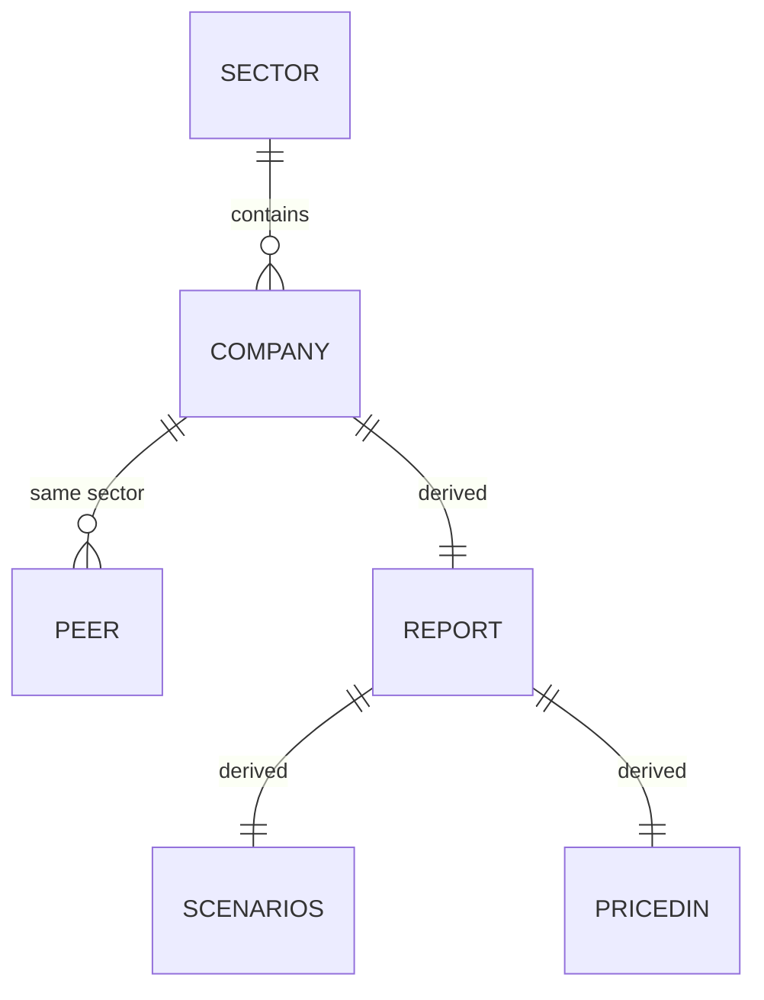

# DATABASE.md — The Data Layer (Static TS + Postgres Mirror)

> **Two data layers. The build-time source of truth is the TypeScript data
> layer in `src/lib/`** (ADR-012): type-checked at build, no migrations, and
> what every page is generated from (all routes stay SSG). A **Supabase
> Postgres mirror** (ADR-013) stores the same content in `sectors`,
> `companies`, and `report_sections` tables, seeded by `npm run db:seed`.
> Server code reads it through a **hybrid store** (`src/lib/store.ts`) that
> tries the DB first and falls back to the bundled static modules when the DB
> is unreachable or unconfigured.
>
> Rule: pages never depend on the DB. If `DATABASE_URL` is absent, builds
> and rendering behave exactly as before the DB existed.

## 1. Entities

### Company (`src/lib/companies.ts`)

`Company` is the core entity; 133 instances are built from `ROWS` tuples.

| Field | Type | Notes |
|---|---|---|
| `slug` | `string` | Unique URL id, kebab-case (e.g., `hdfc-bank`) |
| `name` | `string` | Display name |
| `legalName` | `string` | Full legal entity name |
| `ticker` | `string` | NSE ticker |
| `sector` | `string` | FK → `Sector.slug` |
| `industry` | `string` | Industry label shown on cards |
| `logoColor` | `string` | Hex used by `CompanyLogo` gradient |
| `recommendation` | `"Strong Buy"\|"Buy"\|"Accumulate"\|"Hold"\|"Reduce"\|"Sell"` | Rating enum |
| `currentPrice` | `number` | ₹ per share |
| `targetPrice` | `number` | ₹ per share, 12-month |
| `upsidePct` | `number` | (target − current) / current × 100 |
| `marketCapCr` | `number` | ₹ crore |
| `revenueCr` | `number` | TTM revenue, ₹ crore |
| `netProfitCr` | `number` | TTM net profit, ₹ crore |
| `revenueGrowthPct` | `number` | Latest reported YoY growth % |
| `ebitdaMarginPct` | `number` | % |
| `roePct` | `number` | % |
| `rocePct` | `number` | % |
| `fcfCr` | `number` | TTM free cash flow, ₹ crore |
| `pe` | `number \| null` | `null` → render "—" |
| `dividendYieldPct` | `number` | % |
| `debtEquity` | `number` | x |
| `shortThesis` | `string` | One-sentence investment summary |
| `updatedDate` | `string` | ISO date `YYYY-MM-DD` |

### Sector (`src/lib/sectors.ts`)

| Field | Type | Notes |
|---|---|---|
| `slug` | `string` | Unique, kebab-case (e.g., `information-technology`) |
| `name` | `string` | Display name |
| `description` | `string` | Shown on sector pages |
| `icon` | `string` | Key into `SectorIcon` icon map |

### Derived entities (computed, no storage)

- **Peer set** — `getPeers(company, count)` = same-sector companies sorted by
  `marketCapCr` desc, excluding self.
- **Report** — 25 sections derived by `report.ts` from a `Company`.
- **Scenario cases** (Bull/Base/Bear) — derived by `scenarioCases()`.

## 2. Relationships



- `Company.sector` → `Sector.slug` (**FK, one-to-many**): every company
  belongs to exactly one sector; sectors may have zero companies.
- **Peer set** is a derived relationship (same-sector companies), not stored.
- No company-to-company references are stored (peer cards are computed).

## 3. Constraints & Invariants

Enforced by **TypeScript at build time** (no runtime enforcement needed):

- `slug` unique per company and per sector (checked by lookup functions
  returning first match).
- `recommendation` ∈ the 6-value `Rating` union — any value outside fails
  `npm run build`.
- `pe` nullable — code must render `"—"` (never compute with `null`).
- Every `Company.sector` must match a `Sector.slug`; unknown sectors would
  surface as missing `getSector()` (guarded with fallbacks).
- Financial conventions: money in **₹ crore** (fields ending `Cr`); price in
  **₹ per share**; ratios in %; `debtEquity` as decimal ratio.
- `updatedDate` is ISO `YYYY-MM-DD`; `formatUpdated` renders relative text.

## 4. Indexes (by lookup function)

| Lookup | Equivalent index |
|---|---|
| `getCompany(slug)` | PK on `slug` (array scan — 133 items) |
| `getCompaniesBySector(sectorSlug)` | index on `sector` |
| `getPeers(company, count)` | index on `sector` + sort on `marketCapCr` |
| `sectorCompanyCount(sectorSlug)` | index on `sector` |
| `latestSectorUpdate(sectorSlug)` | index on `sector` + sort on `updatedDate` |
| `getSector(slug)` | PK on `slug` (23 items) |

## 5. Migration History

| Version | Migration |
|---|---|
| 0.1.0 | Created `companies.ts` (133 companies) + `sectors.ts` (23 sectors) |
| 0.2.0 | No schema change; new derived math in `report.ts` |
| 0.3.0 | No schema change; documentation of the schema |

There is no migration tooling; schema changes are type-checked refactors.

## 6. ER Diagram (Markdown)

See § 2 Mermaid diagram. Textual form:

```
Sector (1) ──< Company (N)
  slug            sector (FK)
  name            slug (PK)
  description     …22 fields…
  icon
```

## 7. Postgres mirror (Supabase, connected)

Supabase Postgres at `db.aeondocnbprzdivhzjuv.supabase.co:5432` (db `postgres`,
user `postgres`) holds an instance of the same content. It is a **mirror** for
the API layer and a future enrichment path — never the build source.

### 7.1 Connection (server-only)

- `DATABASE_URL` lives in `.env.local` (gitignored) and in Vercel env vars
  for production. Format:
  `postgresql://postgres:<urlencoded-password>@db.aeondocnbprzdivhzjuv.supabase.co:5432/postgres`
- **Do not put `sslmode=` in the URL** — pg maps `require`/`verify-ca` to
  `verify-full`, which rejects Supabase's self-signed chain. TLS is set in
  code (`ssl: { rejectUnauthorized: false }`, see `src/lib/db.ts`).
- `src/lib/db.ts` is `import "server-only"`: lazy `pg.Pool` singleton
  (`max: 4`, `connectionTimeoutMillis: 5000`), `isDbConfigured()`,
  `pingDb()`, `queryText<T>()`, `withClient<T>()`. All callers must guard
  `isDbConfigured()` — pool creation never throws, queries throw and are
  caught by `src/lib/store.ts`.

### 7.2 Schema (`db/schema.sql`, idempotent)

| Table | PK | Notes |
|---|---|---|
| `sectors` | `slug` | `slug, name, description, icon` |
| `companies` | `slug` | All 22 `Company` fields **snake_case** + `author`; real FK `sector → sectors(slug)`; `CHECK` rating enum; index on `(sector, updated_date DESC)`; `pe` nullable |
| `report_sections` | `(company_slug, section_key)` | `company_slug` FK → `companies.slug` ON DELETE CASCADE; `sort_order`, `label`, `content JSONB` (the derived section payload) |

`report_sections` rows carry the full derived section payload per company
(one JSONB blob per section key, mirrored from `report.ts` render math).

### 7.3 Seeding

- `npm run db:seed` → `scripts/db/seed.ts` (run via `tsx`):
  - Applies `db/schema.sql` (`CREATE TABLE IF NOT EXISTS`), then
    `TRUNCATE ... CASCADE` and batch-inserts: 23 sectors, 133 companies,
    3,325 report sections (133 × 25 `reportToc` sections).
  - Section content is the derived payload for each company (mirrors
    `ReportContent` derivations) stored as JSONB.
  - Idempotent: re-runnable, wipes and reloads.
- Verified against the live DB: `Seed complete: { sectors: '23',
  companies: '133', report_sections: '3325' }`.

### 7.4 Hybrid store (`src/lib/store.ts`, server-only)

| Loader | DB query (try) | Fallback |
|---|---|---|
| `getAllCompanies()` | `SELECT * FROM companies ORDER BY name` | `companies` static array |
| `getAllSectors()` | `SELECT ... FROM sectors ORDER BY name` | `sectors` static array |
| `getCompanyBySlug(slug)` | via `getAllCompanies()` | same |
| `getReportSections(slug)` | `SELECT ... FROM report_sections WHERE company_slug=$1` | `null` |
| `getDbStatus()` | counts over 3 tables | zeros + `reachable:false` |

Memoized per process; catches query failures and falls back to the bundled
arrays — so an unreachable DB degrades to the pre-DB behavior.

### 7.5 API read surface (hybrid-backed, always available)

| Route | Behavior |
|---|---|
| `GET /api/health` | `{ ok, configured, reachable, counts: { companies, sectors, reportSections }, timestamp }` |
| `GET /api/companies` | `{ companies: Company[], sectors: Sector[], count, generatedAt }` |
| `GET /api/companies/[slug]` | `{ company, sections: SectionRow[] \| null }`; 404 JSON on unknown slug |

Routes are dynamic (`ƒ`), DB-first with static fallback — a DB outage returns
the bundled dataset rather than errors. Full contract in `docs/API.md`.

## 8. Future: enrichment

Since every page still generates from `src/lib`, enriching data remains a
`companies.ts`/`sectors.ts` change, then re-seed. Live prices (per §4 of the
old plan) stay a page-generation concern, not a DB one.