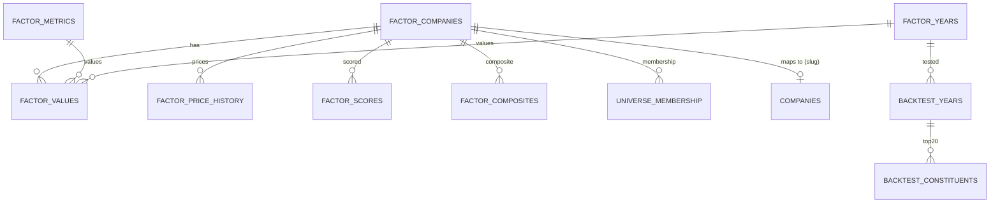

# DATA_MODEL.md — Factor Platform (Postgres Schema)

> Extends the Postgres mirror (`docs/DATABASE.md`) with the factor platform.
> Schema: `db/factor_model.sql` (idempotent, applied by the seed/import
> pipeline before any writes). Model spec: `docs/FACTOR_MODEL.md`.
> All factor data is **read-only for the app** (SELECT); the import pipeline
> (`scripts/factor-model/`, run via `tsx` with `DATABASE_URL`) owns writes.

## 1. New tables

| Table | PK | Purpose |
|---|---|---|
| `factor_companies` | `ric` | 900-company NSE-900 universe + linkage to covered site companies |
| `factor_years` | `fiscal_year` | FY12–FY26 registry (live-year flag, nifty500-filter flag) |
| `factor_metrics` | `metric_key` | Metric catalogue (§3 of FACTOR_MODEL.md): block, weight, direction |
| `factor_values` | `(ric, metric_key, fiscal_year)` | Raw metric values, missing-flag |
| `factor_price_history` | `(ric, fiscal_year)` | Annual close + corrected 1-year momentum + realized 1-year return |
| `factor_scores` | `(ric, block, fiscal_year)` | Block percentile scores + rank within year |
| `factor_composites` | `(ric, fiscal_year)` | Composite score (weighted blocks), overall rank |
| `universe_membership` | `(ric, fiscal_year)` | Nifty500 membership per company-year |
| `backtest_years` | `fiscal_year` | Per-year backtest summary (portfolio/benchmark/excess/IC/n) |
| `backtest_constituents` | `(fiscal_year, rank)` | Top-20 per year: entry/exit prices, return |

### factor_companies

| Column | Type | Notes |
|---|---|---|
| `ric` | TEXT PK | e.g. `RELI.NS`, `MINT.NS^K22` (marker kept) |
| `name` | TEXT | Display name from Companies sheet |
| `market_cap` | NUMERIC | Raw rupee value from Companies sheet (not ₹ crore) |
| `sector` / `industry` | TEXT | From Companies sheet |
| `removed_period` | TEXT NULL | `^K22`-style marker, or NULL if active |
| `company_slug` | TEXT NULL REFERENCES companies(slug) | Link to covered site company (null = uncovered) |

### factor_years

| Column | Type | Notes |
|---|---|---|
| `fiscal_year` | SMALLINT PK | 12..26 |
| `is_live` | BOOLEAN | FY26 = true (no return computable) |
| `nifty500_filtered` | BOOLEAN | FY13+ true; FY12 false (no membership history) |

### factor_metrics

| Column | Type | Notes |
|---|---|---|
| `metric_key` | TEXT PK | `rev_3yr_cagr`, `pe`, `price_close_mom_1y`, … |
| `sheet` | TEXT | Workbook sheet name (e.g. `Rev_3Yr_CAGR`, `P_E`) |
| `block` | TEXT CHECK (growth/quality/valuation/momentum) |
| `block_weight` | NUMERIC | 0.30 / 0.30 / 0.30 / 0.10 |
| `weight_in_block` | NUMERIC | 0.125, 0.142857, or 1.0 |
| `higher_is_better` | BOOLEAN | FALSE → inverted percentile |
| `display_name` | TEXT | For UI |

### factor_values

| Column | Type | Notes |
|---|---|---|
| `ric` | TEXT FK → factor_companies | ON DELETE CASCADE |
| `metric_key` | TEXT FK → factor_metrics | ON DELETE CASCADE |
| `fiscal_year` | SMALLINT FK → factor_years | |
| `value` | NUMERIC | Raw value (missing rows absent; see `missing`) |
| `missing` | BOOLEAN | true → value is NULL/not stored |

PK `(ric, metric_key, fiscal_year)`. Store rows only when the cell is
non-empty (missing companies/years = absent rows).

### factor_price_history

| Column | Type | Notes |
|---|---|---|
| `ric` | TEXT FK | |
| `fiscal_year` | SMALLINT FK | |
| `close` | NUMERIC | Annual close from Price_Close sheet |
| `momentum_1y_pct` | NUMERIC | close(t)/close(t−1) − 1 (corrected, §4 FACTOR_MODEL.md) |
| `return_1y_pct` | NUMERIC | Same as momentum_1y_pct at FY t+1 (realized for backtest) |

PK `(ric, fiscal_year)`.

### factor_scores

| Column | Type | Notes |
|---|---|---|
| `ric` | TEXT FK | |
| `block` | TEXT | growth/quality/valuation/momentum |
| `fiscal_year` | SMALLINT FK | |
| `score` | NUMERIC | Renormalized block percentile, [0,1] |
| `n_metrics_used` | SMALLINT | Metrics contributing (after renorm) |

PK `(ric, block, fiscal_year)`.

### factor_composites

| Column | Type | Notes |
|---|---|---|
| `ric` | TEXT FK | |
| `fiscal_year` | SMALLINT FK | |
| `composite` | NUMERIC | 0.30·G + 0.30·Q + 0.30·V + 0.10·M |
| `rank` | INTEGER | Rank within year (1 = best), ties → RIC |

PK `(ric, fiscal_year)`; index on `(fiscal_year, rank)`.

### universe_membership

| Column | Type | Notes |
|---|---|---|
| `ric` | TEXT FK | |
| `fiscal_year` | SMALLINT FK | |
| `is_member` | BOOLEAN | From Nifty500_Membership (FY12 = false) |

PK `(ric, fiscal_year)`.

### backtest_years

| Column | Type | Notes |
|---|---|---|
| `fiscal_year` | SMALLINT PK | Signal year (FY13–FY25; FY12 excluded by design) |
| `n_eligible` | INTEGER | Eligible companies at signal date |
| `portfolio_return` | NUMERIC | Equal-weighted Top-N 1-year return |
| `benchmark_return` | NUMERIC | Equal-weighted eligible universe return |
| `excess_return` | NUMERIC | portfolio − benchmark |
| `ic` | NUMERIC NULL | Spearman(composite, realized return) |

### backtest_constituents

| Column | Type | Notes |
|---|---|---|
| `fiscal_year` | SMALLINT FK → backtest_years | |
| `rank` | INTEGER | 1..N (Top-N) |
| `ric` | TEXT FK → factor_companies | |
| `entry_close` | NUMERIC | Close at FY signal date |
| `exit_close` | NUMERIC | Close at FY+1 |
| `return_pct` | NUMERIC | exit/entry − 1 |

PK `(fiscal_year, rank)`.

> **Derived, fully rebuilt on every import:** `import.ts` DELETEs both
> backtest tables before reinserting (a plain upsert would leave stale
> FY12 rows behind). The values are seeded by the shared engine
> (`src/lib/factor/engine.ts`) with `DEFAULT_BACKTEST_PARAMS`
> (`src/lib/factor/params.ts`, generated by `factor:optimize`), so the
> static snapshot, the DB and the live API always show the same numbers
> for the same parameters.

## 2. Relationships

- `factor_companies.company_slug` → `companies.slug` (nullable): the 133
  covered site companies join to their factor RIC (screener links out to
  `/company/[slug]`); uncovered RICs render standalone rows.
- All year-scoped tables FK → `factor_years(fiscal_year)`; `backtest_*`
  reference `fiscal_year` as SMALLINT (no separate FK table needed).

## 3. Access & security

- App reads: `SELECT` only (screener APIs). No RLS policies added — the
  existing mirror has none (public DB, anonymous read). If the DB becomes
  internet-exposed, add RLS: `SELECT` for `anon`, `INSERT/UPDATE/DELETE`
  for `service_role` only, per `docs/SECURITY.md`.
- The import pipeline connects with the same `DATABASE_URL` (pg Pool,
  `src/lib/db.ts`-style config) and runs idempotent upserts
  (`ON CONFLICT ... DO UPDATE`).

## 4. Read paths (as built)

The factor platform follows the site rule **pages never depend on the DB**
(`docs/ARCHITECTURE.md`): `scripts/factor-model/snapshot.ts` reduces the
mirror to build-time static modules `src/lib/factor/data.ts` (per-year
ranked composites + block scores, FY12–FY26) and `src/lib/factor/backtest.ts`
(backtest summary + constituents), which are the only things pages import.

| Route | Source |
|---|---|
| `/screener` page | `src/lib/factor/data.ts` via `FactorScreener` client component (year/search/composite/block filters, sort, CSV export) |
| `/company/[slug]` factor sections | `src/lib/factor/data.ts` via `FactorScorecard` |
| `/backtest` page | `src/lib/factor/backtest.ts` (static, instant) + `POST /api/factor/backtest` (dynamic, custom parameters) via `FactorBacktestRunner` client component |

`POST /api/factor/backtest` is the one **dynamic** read path: it SELECTs
the mirror (values/closes/membership/names) into the engine and returns
yearly results + constituents for caller-supplied weights. The page keeps
working without the DB (static snapshot fallback), and the API returns 503
when `DATABASE_URL` is unset or the tables are empty.
| backtest page (planned) | `backtest_years`/`backtest_constituents` via a second static snapshot or direct import |

Regeneration: `npm run factor:import` (DB) then `npm run factor:snapshot`
(static module).

## 5. Migration history

| Version | Migration |
|---|---|
| 1.0 (2026-08-08) | Initial factor schema (`db/factor_model.sql`) + pipeline + docs |
